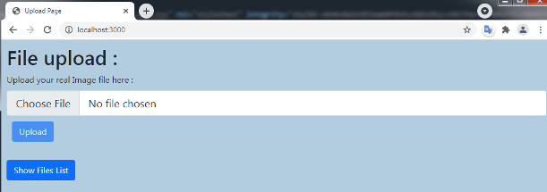
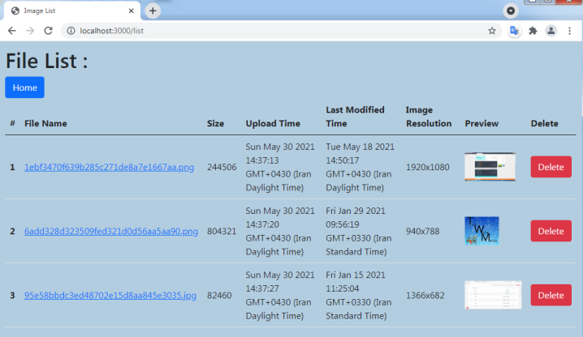
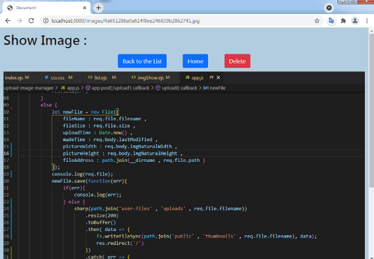

# Simple Image Upload Manager
A very simple image uploading and managing web app by nodejs, using express, ejs, mongoDB, mongoose, multer , sharp.

### Introduction :
You can easily upload a real image(the front end validates it thoroughly , even if it’s a fake image file with image extension).
Files stores with hashed names in the database and disk and a thumbnail will create and you can watch them or delete them from disk and Database.
For simplicity, it contains a very simple front end, and simple express structure in app.js(not routing structure).

### Technologies :
* Node.js
* MongoDB
* mongoose
* EJS
* multer
* sharp
* crypto
* Bootstrap

### Requirements :
To run the project you need to have installed NodeJs, MongoDB.

### Screenshots :

Main Page :

List Page :

Image Show Page :

### Run the app
after stablishing MongoDB databsase

Open terminal in the project folder

// to install packages :

$npm install

// to run the app :

$node app.js

// open the browser on port 3000

http://localhost:3000/

// To stop the server :
just press Ctrl+C in Terminal

